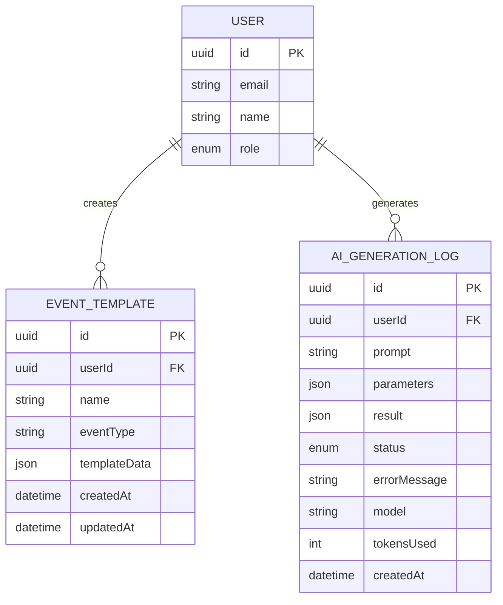

# EventEase Database Schema and Integration Guide

This document provides a comprehensive database schema for the EventEase application and detailed guidance on how to integrate it with the frontend pages.

## Table of Contents

1. [Database Schema](#database-schema)
   - [Entity Relationship Diagram](#entity-relationship-diagram)
   - [Tables and Relationships](#tables-and-relationships)
2. [Data Models](#data-models)
   - [User Model](#user-model)
   - [Organizer Model](#organizer-model)
   - [Event Model](#event-model)
   - [Ticket Model](#ticket-model)
   - [Order Model](#order-model)
   - [Additional Models](#additional-models)
3. [API Endpoints](#api-endpoints)
   - [Authentication Endpoints](#authentication-endpoints)
   - [User Endpoints](#user-endpoints)
   - [Event Endpoints](#event-endpoints)
   - [Organizer Endpoints](#organizer-endpoints)
   - [Admin Endpoints](#admin-endpoints)
   - [Order Management Endpoints](#order-management-endpoints)
4. [Page-Specific Data Integration](#page-specific-data-integration)
   - [Home Page](#home-page)
   - [Events Listing Page](#events-listing-page)
   - [Event Detail Page](#event-detail-page)
   - [User Dashboard](#user-dashboard)
   - [Organizer Dashboard](#organizer-dashboard)
   - [Admin Dashboard](#admin-dashboard)
   - [Order Management Dashboard](#order-management-dashboard)
5. [Implementation Guidelines](#implementation-guidelines)
   - [Database Setup](#database-setup)
   - [API Implementation](#api-implementation)
   - [Authentication and Authorization](#authentication-and-authorization)
   - [Data Validation](#data-validation)
   - [Error Handling](#error-handling)
   - [File Storage](#file-storage)
   - [Payment Integration](#payment-integration)
6. [Data Migration and Seeding](#data-migration-and-seeding)
   - [Initial Data Setup](#initial-data-setup)
   - [Migration Strategies](#migration-strategies)
7. [Performance Considerations](#performance-considerations)
   - [Indexing Strategy](#indexing-strategy)
   - [Query Optimization](#query-optimization)
   - [Caching Strategy](#caching-strategy)

## Database Schema

### Entity Relationship Diagram

\`\`\`mermaid
erDiagram
    USER {
        uuid id PK
        string email
        string password
        string name
        string phone
        string avatar
        enum role
        enum status
        datetime joinDate
        datetime lastLogin
        boolean emailVerified
        datetime createdAt
        datetime updatedAt
    }
    
    ORGANIZER {
        uuid userId PK,FK
        string companyName
        string description
        string logo
        string website
        json socialMedia
        string address
        string region
        string tinNumber
        boolean verified
        json verificationDocuments
        int followers
        int totalEvents
        enum status
        datetime createdAt
        datetime updatedAt
    }
    
    EVENT {
        uuid id PK
        string title
        string description
        string longDescription
        date eventDate
        string time
        string location
        string address
        string region
        string price
        string category
        enum status
        string image
        json gallery
        uuid organizerId FK
        int attendees
        int maxAttendees
        decimal revenue
        decimal expenses
        decimal profit
        boolean featured
        datetime createdAt
        datetime updatedAt
    }
    
    TICKET_TYPE {
        uuid id PK
        uuid eventId FK
        string name
        string description
        decimal price
        string currency
        int quantity
        int sold
        int available
        date startDate
        date endDate
        int minPerOrder
        int maxPerOrder
        json benefits
        string requirements
        boolean transferable
        boolean refundable
        decimal revenue
        datetime createdAt
        datetime updatedAt
    }
    
    ORDER {
        uuid id PK
        uuid userId FK
        uuid eventId FK
        decimal totalAmount
        string currency
        enum status
        string paymentMethod
        string transactionId
        uuid promotionId FK
        decimal discountAmount
        datetime purchaseDate
        string billingName
        string billingEmail
        string billingAddress
        datetime createdAt
        datetime updatedAt
    }
    
    ORDER_ITEM {
        uuid id PK
        uuid orderId FK
        uuid ticketTypeId FK
        int quantity
        decimal unitPrice
        decimal totalPrice
        string attendeeName
        string attendeeEmail
        enum checkInStatus
        datetime checkInTime
        string ticketCode
        datetime createdAt
        datetime updatedAt
    }
    
    EVENT_SCHEDULE {
        uuid id PK
        uuid eventId FK
        string time
        string title
        string description
        string location
        string speaker
        datetime createdAt
        datetime updatedAt
    }
    
    EVENT_FAQ {
        uuid id PK
        uuid eventId FK
        string question
        string answer
        int order
        datetime createdAt
        datetime updatedAt
    }
    
    PROMOTION {
        uuid id PK
        uuid eventId FK
        string code
        enum discountType
        decimal discountValue
        int maxUses
        int used
        int available
        date startDate
        date endDate
        datetime createdAt
        datetime updatedAt
    }
    
    FEEDBACK {
        uuid id PK
        uuid eventId FK
        uuid userId FK
        int rating
        string comment
        datetime createdAt
        datetime updatedAt
    }
    
    NOTIFICATION {
        uuid id PK
        uuid userId FK
        string title
        string message
        string type
        boolean read
        string link
        datetime createdAt
    }
    
    PAYMENT_TRANSACTION {
        uuid id PK
        uuid orderId FK
        string transactionId
        string provider
        decimal amount
        string currency
        enum status
        json metadata
        datetime transactionDate
        datetime createdAt
        datetime updatedAt
    }
    
    USER ||--o{ ORDER : places
    USER ||--o{ FEEDBACK : provides
    USER ||--o| ORGANIZER : can_be
    USER ||--o{ NOTIFICATION : receives
    
    ORGANIZER ||--o{ EVENT : creates
    
    EVENT ||--o{ TICKET_TYPE : has
    EVENT ||--o{ EVENT_SCHEDULE : has
    EVENT ||--o{ EVENT_FAQ : has
    EVENT ||--o{ PROMOTION : has
    EVENT ||--o{ FEEDBACK : receives
    EVENT ||--o{ ORDER : has
    
    ORDER ||--o{ ORDER_ITEM : contains
    ORDER ||--o| PROMOTION : applies
    ORDER ||--o{ PAYMENT_TRANSACTION : processes
    
    TICKET_TYPE ||--o{ ORDER_ITEM : purchased_as
\`\`\`

### Tables and Relationships

#### Core Tables

1. **Users**
   - Stores all user information
   - Different roles: admin, organizer, attendee

2. **Organizers**
   - Extends Users with organizer-specific information
   - One-to-one relationship with Users (where role is "organizer")
   - Includes TIN number and verification status

3. **Events**
   - Stores event information
   - Created by organizers
   - Includes financial tracking (revenue, expenses, profit)

4. **Ticket Types**
   - Different ticket categories for events
   - Belongs to an event
   - Tracks availability and sales

5. **Orders**
   - Ticket purchases by users
   - Contains order items
   - Tracks payment status and billing information

6. **Order Items**
   - Individual tickets within an order
   - Belongs to an order and references a ticket type
   - Includes check-in status and unique ticket codes

#### Supporting Tables

7. **Event Schedule**
   - Schedule/agenda items for events

8. **Event FAQs**
   - Frequently asked questions for events

9. **Promotions**
   - Discount codes for events
   - Tracks usage and availability

10. **Feedback**
    - User reviews and ratings for events

11. **Notifications**
    - System notifications for users
    - Includes read status and action links

12. **Payment Transactions**
    - Detailed payment records
    - Links to orders
    - Stores provider-specific metadata

## Data Models

### User Model

\`\`\`typescript
interface User {
  id: string;                 // UUID primary key
  email: string;              // Unique email address
  password: string;           // Hashed password
  name: string;               // Full name
  phone?: string;             // Optional phone number
  avatar?: string;            // URL to profile image
  bio?: string;               // User bio/about text
  address?: string;           // User address
  role: 'admin' | 'organizer' | 'attendee';  // User role
  status: 'active' | 'inactive' | 'pending'; // Account status
  joinDate: Date;             // When user joined
  lastLogin?: Date;           // Last login timestamp
  emailVerified: boolean;     // Whether email is verified
  resetPasswordToken?: string; // For password reset
  resetPasswordExpires?: Date; // Token expiration
  createdAt: Date;            // Record creation timestamp
  updatedAt: Date;            // Record update timestamp
  preferences?: UserPreferences; // User preferences for the platform
}

// New interface for user preferences
interface UserPreferences {
  notificationSettings: {
    email: boolean;           // Email notifications
    push: boolean;            // Push notifications
    sms: boolean;             // SMS notifications
  };
  categories: string[];       // Preferred event categories
  locations: string[];        // Preferred event locations
  calendarSync: boolean;      // Whether to sync with external calendar
}
\`\`\`

### Organizer Model

\`\`\`typescript
interface Organizer {
  userId: string;             // Foreign key to User
  companyName: string;        // Legal company name
  description?: string;       // Company description
  logo?: string;              // URL to logo image
  website?: string;           // Company website
  socialMedia?: {             // Social media links
    facebook?: string;
    twitter?: string;
    instagram?: string;
    linkedin?: string;
  };
  address?: string;           // Physical address
  region?: string;            // Region/state
  tinNumber: string;          // Tax Identification Number
  verified: boolean;          // Verification status
  verificationDocuments: string[]; // URLs to uploaded documents
  followers: number;          // Number of followers
  totalEvents: number;        // Total events created
  status: 'approved' | 'pending' | 'rejected'; // Approval status
  createdAt: Date;            // Record creation timestamp
  updatedAt: Date;            // Record update timestamp
}
\`\`\`

### Event Model

\`\`\`typescript
interface Event {
  id: string;                 // UUID primary key
  title: string;              // Event title
  description: string;        // Short description
  longDescription?: string;   // Detailed description (HTML)
  eventDate: Date;            // Event date
  time: string;               // Event time range
  location: string;           // Location name
  address: string;            // Full address
  region: string;             // Region/city
  price: string;              // Display price (e.g., "ETB 500")
  category: string;           // Event category
  status: 'draft' | 'pending' | 'published' | 'cancelled'; // Event status
  image: string;              // Main event image URL
  gallery: string[];          // Additional image URLs
  organizerId: string;        // Foreign key to Organizer
  attendees: number;          // Current attendee count
  maxAttendees?: number;      // Maximum capacity
  revenue: number;            // Total revenue
  expenses: number;           // Total expenses
  profit: number;             // Calculated profit
  featured: boolean;          // Whether event is featured
  createdAt: Date;            // Record creation timestamp
  updatedAt: Date;            // Record update timestamp
}
\`\`\`

### Ticket Model

\`\`\`typescript
interface TicketType {
  id: string;                 // UUID primary key
  eventId: string;            // Foreign key to Event
  name: string;               // Ticket name (e.g., "VIP")
  description?: string;       // Ticket description
  price: number;              // Ticket price
  currency: string;           // Currency code (default: "ETB")
  quantity: number;           // Total available tickets
  sold: number;               // Number sold
  available: number;          // Calculated available tickets
  startDate?: Date;           // Sales start date
  endDate?: Date;             // Sales end date
  minPerOrder: number;        // Minimum purchase quantity
  maxPerOrder?: number;       // Maximum purchase quantity
  benefits: string[];         // Ticket benefits
  requirements?: string;      // Special requirements
  transferable: boolean;      // Whether transferable
  refundable: boolean;        // Whether refundable
  revenue: number;            // Total revenue from this ticket type
  createdAt: Date;            // Record creation timestamp
  updatedAt: Date;            // Record update timestamp
}
\`\`\`

### Order Model

\`\`\`typescript
interface Order {
  id: string;                 // UUID primary key
  userId: string;             // Foreign key to User
  eventId: string;            // Foreign key to Event
  totalAmount: number;        // Total order amount
  currency: string;           // Currency code
  status: 'pending' | 'completed' | 'cancelled' | 'refunded' | 'failed'; // Order status
  paymentMethod: string;      // Payment method used
  transactionId?: string;     // Payment provider transaction ID
  promotionId?: string;       // Foreign key to Promotion
  discountAmount: number;     // Discount amount applied
  purchaseDate: Date;         // Purchase timestamp
  billingName: string;        // Customer billing name
  billingEmail: string;       // Customer billing email
  billingAddress?: string;    // Customer billing address
  createdAt: Date;            // Record creation timestamp
  updatedAt: Date;            // Record update timestamp
  items: OrderItem[];         // Order items (tickets)
}

interface OrderItem {
  id: string;                 // UUID primary key
  orderId: string;            // Foreign key to Order
  ticketTypeId: string;       // Foreign key to TicketType
  quantity: number;           // Quantity purchased
  unitPrice: number;          // Price per ticket
  totalPrice: number;         // Total price for this item
  attendeeName?: string;      // Attendee name
  attendeeEmail?: string;     // Attendee email
  checkInStatus: 'not_checked' | 'checked_in' | 'cancelled'; // Check-in status
  checkInTime?: Date;         // Check-in timestamp
  ticketCode: string;         // Unique ticket identifier/barcode
  createdAt: Date;            // Record creation timestamp
  updatedAt: Date;            // Record update timestamp
}
\`\`\`

### Additional Models

\`\`\`typescript
interface EventSchedule {
  id: string;                 // UUID primary key
  eventId: string;            // Foreign key to Event
  time: string;               // Time slot
  title: string;              // Schedule item title
  description?: string;       // Description
  location: string;           // Location within venue
  speaker?: string;           // Speaker name
  createdAt: Date;            // Record creation timestamp
  updatedAt: Date;            // Record update timestamp
}

interface EventFAQ {
  id: string;                 // UUID primary key
  eventId: string;            // Foreign key to Event
  question: string;           // Question text
  answer: string;             // Answer text
  order?: number;             // Display order
  createdAt: Date;            // Record creation timestamp
  updatedAt: Date;            // Record update timestamp
}

interface Promotion {
  id: string;                 // UUID primary key
  eventId: string;            // Foreign key to Event
  code: string;               // Promotion code
  discountType: 'percentage' | 'fixed'; // Discount type
  discountValue: number;      // Discount amount
  maxUses?: number;           // Maximum number of uses
  used: number;               // Times used
  available: number;          // Calculated available uses
  startDate?: Date;           // Valid from date
  endDate?: Date;             // Valid until date
  createdAt: Date;            // Record creation timestamp
  updatedAt: Date;            // Record update timestamp
}

interface Feedback {
  id: string;                 // UUID primary key
  eventId: string;            // Foreign key to Event
  userId: string;             // Foreign key to User
  rating: number;             // Rating (1-5)
  comment?: string;           // Comment text
  createdAt: Date;            // Record creation timestamp
  updatedAt: Date;            // Record update timestamp
}

interface Notification {
  id: string;                 // UUID primary key
  userId: string;             // Foreign key to User
  title: string;              // Notification title
  message: string;            // Notification message
  type: 'ticket' | 'reminder' | 'recommendation' | 'price' | 'cancellation' | 'system'; // Notification type
  read: boolean;              // Whether notification has been read
  link?: string;              // Optional action link
  actionUrl?: string;         // URL to navigate to when clicked
  createdAt: Date;            // Creation timestamp
}

interface PaymentTransaction {
  id: string;                 // UUID primary key
  orderId: string;            // Foreign key to Order
  transactionId: string;      // Payment provider transaction ID
  provider: string;           // Payment provider name
  amount: number;             // Transaction amount
  currency: string;           // Currency code
  status: 'pending' | 'completed' | 'failed' | 'refunded'; // Transaction status
  metadata: any;              // Provider-specific metadata
  transactionDate: Date;      // When transaction occurred
  createdAt: Date;            // Record creation timestamp
  updatedAt: Date;            // Record update timestamp
}

// New models for attendee features

interface SavedEvent {
  id: string;                 // UUID primary key
  userId: string;             // Foreign key to User
  eventId: string;            // Foreign key to Event
  savedAt: Date;              // When event was saved
  notes?: string;             // Optional notes about the saved event
  createdAt: Date;            // Record creation timestamp
  updatedAt: Date;            // Record update timestamp
}

interface EventReminder {
  id: string;                 // UUID primary key
  userId: string;             // Foreign key to User
  eventId: string;            // Foreign key to Event
  reminderDate: Date;         // When to send the reminder
  reminderSent: boolean;      // Whether reminder has been sent
  reminderType: 'email' | 'push' | 'sms'; // Type of reminder
  createdAt: Date;            // Record creation timestamp
  updatedAt: Date;            // Record update timestamp
}

interface UserEventInteraction {
  id: string;                 // UUID primary key
  userId: string;             // Foreign key to User
  eventId: string;            // Foreign key to Event
  interactionType: 'view' | 'click' | 'share' | 'bookmark' | 'purchase'; // Type of interaction
  interactionDate: Date;      // When interaction occurred
  metadata?: any;             // Additional metadata about interaction
  createdAt: Date;            // Record creation timestamp
}

interface Calendar {
  id: string;                 // UUID primary key
  userId: string;             // Foreign key to User
  name: string;               // Calendar name
  color: string;              // Calendar color (hex code)
  isDefault: boolean;         // Whether this is the default calendar
  externalCalendarId?: string; // ID for external calendar sync
  externalCalendarType?: 'google' | 'outlook' | 'apple'; // Type of external calendar
  createdAt: Date;            // Record creation timestamp
  updatedAt: Date;            // Record update timestamp
}

interface CalendarEvent {
  id: string;                 // UUID primary key
  calendarId: string;         // Foreign key to Calendar
  eventId?: string;           // Optional foreign key to Event (if related to platform event)
  title: string;              // Event title
  description?: string;       // Event description
  startDate: Date;            // Event start date and time
  endDate: Date;              // Event end date and time
  location?: string;          // Event location
  isAllDay: boolean;          // Whether event is all day
  recurrence?: string;        // Recurrence rule (RRULE format)
  reminder?: number;          // Reminder time in minutes before event
  createdAt: Date;            // Record creation timestamp
  updatedAt: Date;            // Record update timestamp
}
\`\`\`

## API Endpoints

### Authentication Endpoints

\`\`\`typescript
/**
 * User Registration
 * POST /api/auth/register
 * 
 * Request Body:
 * {
 *   name: string,
 *   email: string,
 *   password: string,
 *   phone?: string,
 *   role: 'attendee' | 'organizer'
 * }
 * 
 * Response:
 * {
 *   success: boolean,
 *   message: string,
 *   user?: {
 *     id: string,
 *     name: string,
 *     email: string,
 *     role: string
 *   },
 *   token?: string
 * }
 */

/**
 * User Login
 * POST /api/auth/login
 * 
 * Request Body:
 * {
 *   email: string,
 *   password: string
 * }
 * 
 * Response:
 * {
 *   success: boolean,
 *   message: string,
 *   user?: {
 *     id: string,
 *     name: string,
 *     email: string,
 *     role: string
 *   },
 *   token?: string
 * }
 */

/**
 * Logout
 * POST /api/auth/logout
 * 
 * Response:
 * {
 *   success: boolean,
 *   message: string
 * }
 */

/**
 * Get Current User
 * GET /api/auth/me
 * 
 * Response:
 * {
 *   success: boolean,
 *   user?: {
 *     id: string,
 *     name: string,
 *     email: string,
 *     role: string,
 *     avatar?: string,
 *     // Additional fields based on role
 *   }
 * }
 */

/**
 * Password Reset Request
 * POST /api/auth/reset-password-request
 * 
 * Request Body:
 * {
 *   email: string
 * }
 * 
 * Response:
 * {
 *   success: boolean,
 *   message: string
 * }
 */

/**
 * Password Reset
 * POST /api/auth/reset-password
 * 
 * Request Body:
 * {
 *   token: string,
 *   password: string
 * }
 * 
 * Response:
 * {
 *   success: boolean,
 *   message: string
 * }
 */

/**
 * Email Verification
 * GET /api/auth/verify-email/:token
 * 
 * Response:
 * {
 *   success: boolean,
 *   message: string
 * }
 */

/**
 * Refresh Token
 * POST /api/auth/refresh-token
 * 
 * Request Body:
 * {
 *   refreshToken: string
 * }
 * 
 * Response:
 * {
 *   success: boolean,
 *   token?: string,
 *   refreshToken?: string
 * }
 */
\`\`\`

### User Endpoints

\`\`\`typescript
/**
 * Get User Profile
 * GET /api/users/profile
 * 
 * Response:
 * {
 *   success: boolean,
 *   user: {
 *     id: string,
 *     name: string,
 *     email: string,
 *     phone?: string,
 *     avatar?: string,
 *     role: string,
 *     // Additional fields based on role
 *   }
 * }
 */

/**
 * Update User Profile
 * PUT /api/users/profile
 * 
 * Request Body:
 * {
 *   name?: string,
 *   phone?: string,
 *   avatar?: string,
 *   // Other updatable fields
 * }
 * 
 * Response:
 * {
 *   success: boolean,
 *   message: string,
 *   user?: {
 *     // Updated user object
 *   }
 * }
 */

/**
 * Get User Orders
 * GET /api/users/orders
 * 
 * Query Parameters:
 * - page: number
 * - limit: number
 * - status?: 'pending' | 'completed' | 'cancelled' | 'refunded'
 * 
 * Response:
 * {
 *   success: boolean,
 *   orders: [
 *     {
 *       id: string,
 *       eventId: string,
 *       eventTitle: string,
 *       eventDate: string,
 *       totalAmount: number,
 *       status: string,
 *       purchaseDate: string,
 *       // Other order details
 *     }
 *   ],
 *   pagination: {
 *     total: number,
 *     page: number,
 *     limit: number,
 *     pages: number
 *   }
 * }
 */

/**
 * Get User Events (events user is attending)
 * GET /api/users/events
 * 
 * Query Parameters:
 * - page: number
 * - limit: number
 * - upcoming?: boolean
 * - past?: boolean
 * 
 * Response:
 * {
 *   success: boolean,
 *   events: [
 *     {
 *       id: string,
 *       title: string,
 *       date: string,
 *       time: string,
 *       location: string,
 *       image: string,
 *       ticketType: string,
 *       // Other event details
 *     }
 *   ],
 *   pagination: {
 *     total: number,
 *     page: number,
 *     limit: number,
 *     pages: number
 *   }
 * }
 */

/**
 * Get User Notifications
 * GET /api/users/notifications
 * 
 * Query Parameters:
 * - page: number
 * - limit: number
 * - unreadOnly?: boolean
 * 
 * Response:
 * {
 *   success: boolean,
 *   notifications: [
 *     {
 *       id: string,
 *       title: string,
 *       message: string,
 *       type: string,
 *       read: boolean,
 *       link?: string,
 *       createdAt: string
 *     }
 *   ],
 *   unreadCount: number,
 *   pagination: {
 *     total: number,
 *     page: number,
 *     limit: number,
 *     pages: number
 *   }
 * }
 */

/**
 * Mark Notification as Read
 * PUT /api/users/notifications/:id/read
 * 
 * Response:
 * {
 *   success: boolean,
 *   message: string
 * }
 */

/**
 * Mark All Notifications as Read
 * PUT /api/users/notifications/read-all
 * 
 * Response:
 * {
 *   success: boolean,
 *   message: string,
 *   count: number
 * }
 */

/**
 * Delete Notification
 * DELETE /api/users/notifications/:id
 * Authorization: Required
 * 
 * Response:
 * {
 *   success: boolean,
 *   message: string
 * }
 */

/**
 * Clear Read Notifications
 * DELETE /api/users/notifications/read
 * Authorization: Required
 * 
 * Response:
 * {
 *   success: boolean,
 *   message: string,
 *   count: number // Number of notifications deleted
 * }
 */

// New endpoints for attendee features

/**
 * Get User Saved Events
 * GET /api/users/saved-events
 * 
 * Query Parameters:
 * - page: number
 * - limit: number
 * - category?: string
 * - sortBy?: 'date' | 'recent' | 'title'
 * 
 * Response:
 * {
 *   success: boolean,
 *   savedEvents: [
 *     {
 *       id: string,
 *       eventId: string,
 *       title: string,
 *       date: string,
 *       location: string,
 *       price: string,
 *       category: string,
 *       image: string,
 *       savedAt: string
 *     }
 *   ],
 *   pagination: {
 *     total: number,
 *     page: number,
 *     limit: number,
 *     pages: number
 *   }
 * }
 */

/**
 * Save Event
 * POST /api/users/saved-events
 * 
 * Request Body:
 * {
 *   eventId: string,
 *   notes?: string
 * }
 * 
 * Response:
 * {
 *   success: boolean,
 *   message: string,
 *   savedEvent?: {
 *     id: string,
 *     eventId: string,
 *     savedAt: string
 *   }
 * }
 */

/**
 * Remove Saved Event
 * DELETE /api/users/saved-events/:eventId
 * 
 * Response:
 * {
 *   success: boolean,
 *   message: string
 * }
 */

/**
 * Clear All Saved Events
 * DELETE /api/users/saved-events
 * 
 * Response:
 * {
 *   success: boolean,
 *   message: string,
 *   count: number
 * }
 */

/**
 * Get User Tickets
 * GET /api/users/tickets
 * 
 * Query Parameters:
 * - status?: 'upcoming' | 'past' | 'cancelled'
 * 
 * Response:
 * {
 *   success: boolean,
 *   tickets: [
 *     {
 *       id: string,
 *       eventId: string,
 *       eventTitle: string,
 *       eventDate: string,
 *       eventLocation: string,
 *       ticketType: string,
 *       price: string,
 *       quantity: number,
 *       status: string,
 *       bookingReference: string,
 *       purchaseDate: string
 *     }
 *   ]
 * }
 */

/**
 * Download Ticket
 * GET /api/users/tickets/:id/download
 * 
 * Response:
 * PDF file download
 */

/**
 * Cancel Ticket
 * PUT /api/users/tickets/:id/cancel
 * 
 * Request Body:
 * {
 *   reason?: string
 * }
 * 
 * Response:
 * {
 *   success: boolean,
 *   message: string,
 *   ticket?: {
 *     // Updated ticket object
 *   }
 * }
 */

/**
 * Get Ticket QR Code
 * GET /api/users/tickets/:id/qr-code
 * Authorization: Required
 * 
 * Response:
 * {
 *   success: boolean,
 *   qrCodeData: string, // Base64 encoded QR code image
 *   ticketReference: string
 * }
 */

/**
 * Get User Calendar
 * GET /api/users/calendar
 * 
 * Query Parameters:
 * - month: number
 * - year: number
 * 
 * Response:
 * {
 *   success: boolean,
 *   events: [
 *     {
 *       id: string,
 *       title: string,
 *       startDate: string,
 *       endDate: string,
 *       isAllDay: boolean,
 *       location?: string,
 *       eventId?: string,
 *       calendarId: string,
 *       calendarName: string,
 *       calendarColor: string
 *     }
 *   ]
 * }
 */

/**
 * Create Calendar Event
 * POST /api/users/calendar/events
 * 
 * Request Body:
 * {
 *   calendarId: string,
 *   eventId?: string,
 *   title: string,
 *   description?: string,
 *   startDate: string,
 *   endDate: string,
 *   location?: string,
 *   isAllDay: boolean,
 *   recurrence?: string,
 *   reminder?: number
 * }
 * 
 * Response:
 * {
 *   success: boolean,
 *   message: string,
 *   calendarEvent?: {
 *     // Created calendar event object
 *   }
 * }
 */

/**
 * Update Calendar Event
 * PUT /api/users/calendar/events/:id
 * 
 * Request Body:
 * {
 *   // Fields to update
 * }
 * 
 * Response:
 * {
 *   success: boolean,
 *   message: string,
 *   calendarEvent?: {
 *     // Updated calendar event object
 *   }
 * }
 */

/**
 * Delete Calendar Event
 * DELETE /api/users/calendar/events/:id
 * 
 * Response:
 * {
 *   success: boolean,
 *   message: string
 * }
 */

/**
 * Get User Calendars
 * GET /api/users/calendars
 * 
 * Response:
 * {
 *   success: boolean,
 *   calendars: [
 *     {
 *       id: string,
 *       name: string,
 *       color: string,
 *       isDefault: boolean,
 *       externalCalendarType?: string
 *     }
 *   ]
 * }
 */

/**
 * Create Calendar
 * POST /api/users/calendars
 * 
 * Request Body:
 * {
 *   name: string,
 *   color: string,
 *   isDefault?: boolean
 * }
 * 
 * Response:
 * {
 *   success: boolean,
 *   message: string,
 *   calendar?: {
 *     // Created calendar object
 *   }
 * }
 */

/**
 * Connect External Calendar
 * POST /api/users/calendars/connect
 * 
 * Request Body:
 * {
 *   calendarId: string,
 *   externalCalendarType: 'google' | 'outlook' | 'apple',
 *   authCode: string
 * }
 * 
 * Response:
 * {
 *   success: boolean,
 *   message: string,
 *   calendar?: {
 *     // Updated calendar object
 *   }
 * }
 */

/**
 * Sync Calendar
 * POST /api/users/calendars/:id/sync
 * 
 * Response:
 * {
 *   success: boolean,
 *   message: string,
 *   eventsAdded: number,
 *   eventsUpdated: number,
 *   eventsRemoved: number
 * }
 */

/**
 * Get Event Feed
 * GET /api/users/feed
 * 
 * Query Parameters:
 * - page: number
 * - limit: number
 * - search?: string
 * - category?: string
 * - date?: 'all' | 'upcoming' | 'today' | 'tomorrow' | 'weekend' | 'week'
 * 
 * Response:
 * {
 *   success: boolean,
 *   events: [
 *     {
 *       id: string,
 *       title: string,
 *       description: string,
 *       date: string,
 *       time: string,
 *       location: string,
 *       price: string,
 *       category: string,
 *       attendees: number,
 *       image: string,
 *       isSaved: boolean
 *     }
 *   ],
 *   pagination: {
 *     total: number,
 *     page: number,
 *     limit: number,
 *     pages: number
 *   }
 * }
 */

/**
 * Get User Recommendations
 * GET /api/users/recommendations
 * 
 * Query Parameters:
 * - limit: number
 * 
 * Response:
 * {
 *   success: boolean,
 *   events: [
 *     {
 *       id: string,
 *       title: string,
 *       date: string,
 *       location: string,
 *       price: string,
 *       category: string,
 *       image: string,
 *       matchScore: number, // How well it matches user preferences
 *       matchReason: string // Reason for recommendation
 *     }
 *   ]
 * }
 */

/**
 * Update Notification Settings
 * PUT /api/users/notification-settings
 * 
 * Request Body:
 * {
 *   email: boolean,
 *   push: boolean,
 *   sms: boolean
 * }
 * 
 * Response:
 * {
 *   success: boolean,
 *   message: string,
 *   settings?: {
 *     // Updated notification settings
 *   }
 * }
 */

/**
 * Update User Preferences
 * PUT /api/users/preferences
 * 
 * Request Body:
 * {
 *   categories?: string[],
 *   locations?: string[],
 *   calendarSync?: boolean
 * }
 * 
 * Response:
 * {
 *   success: boolean,
 *   message: string,
 *   preferences?: {
 *     // Updated user preferences
 *   }
 * }
 */
\`\`\`

### Event Endpoints

\`\`\`typescript
/**
 * Get Events
 * GET /api/events
 * 
 * Query Parameters:
 * - page: number
 * - limit: number
 * - search?: string
 * - category?: string
 * - location?: string
 * - date?: string
 * - featured?: boolean
 * - sort?: 'date' | 'popularity' | 'price'
 * 
 * Response:
 * {
 *   success: boolean,
 *   events: [
 *     {
 *       id: string,
 *       title: string,
 *       description: string,
 *       date: string,
 *       time: string,
 *       location: string,
 *       price: string,
 *       category: string,
 *       image: string,
 *       attendees: number,
 *       organizer: {
 *         id: string,
 *         name: string,
 *         logo?: string
 *       }
 *     }
 *   ],
 *   pagination: {
 *     total: number,
 *     page: number,
 *     limit: number,
 *     pages: number
 *   }
 * }
 */

/**
 * Get Event by ID
 * GET /api/events/:id
 * 
 * Response:
 * {
 *   success: boolean,
 *   event: {
 *     id: string,
 *     title: string,
 *     description: string,
 *     longDescription: string,
 *     date: string,
 *     time: string,
 *     location: string,
 *     address: string,
 *     price: string,
 *     category: string,
 *     image: string,
 *     gallery: string[],
 *     attendees: number,
 *     maxAttendees: number,
 *     organizer: {
 *       id: string,
 *       name: string,
 *       logo?: string,
 *       description?: string,
 *       website?: string,
 *       email?: string,
 *       phone?: string
 *     },
 *     ticketTypes: [
 *       {
 *         id: string,
 *         name: string,
 *         description: string,
 *         price: number,
 *         available: number,
 *         benefits: string[],
 *         requirements?: string
 *       }
 *     ],
 *     schedule: [
 *       {
 *         time: string,
 *         title: string,
 *         description?: string,
 *         location: string,
 *         speaker?: string
 *       }
 *     ],
 *     faqs: [
 *       {
 *         question: string,
 *         answer: string
 *       }
 *     ]
 *   },
 *   relatedEvents: [
 *     // Similar structure to events in GET /api/events
 *   ]
 * }
 */

/**
 * Create Event
 * POST /api/events
 * Authorization: Required (Organizer)
 * 
 * Request Body:
 * {
 *   title: string,
 *   description: string,
 *   longDescription?: string,
 *   date: string,
 *   time: string,
 *   location: string,
 *   address: string,
 *   region: string,
 *   category: string,
 *   image: string,
 *   gallery?: string[],
 *   maxAttendees?: number,
 *   // Other event fields
 * }
 * 
 * Response:
 * {
 *   success: boolean,
 *   message: string,
 *   event?: {
 *     id: string,
 *     // Created event object
 *   }
 * }
 */

/**
 * Update Event
 * PUT /api/events/:id
 * Authorization: Required (Event Owner or Admin)
 * 
 * Request Body:
 * {
 *   // Fields to update
 * }
 * 
 * Response:
 * {
 *   success: boolean,
 *   message: string,
 *   event?: {
 *     // Updated event object
 *   }
 * }
 */

/**
 * Delete Event
 * DELETE /api/events/:id
 * Authorization: Required (Event Owner or Admin)
 * 
 * Response:
 * {
 *   success: boolean,
 *   message: string
 * }
 */

/**
 * Get Event Tickets
 * GET /api/events/:id/tickets
 * 
 * Response:
 * {
 *   success: boolean,
 *   tickets: [
 *     {
 *       id: string,
 *       name: string,
 *       description: string,
 *       price: number,
 *       currency: string,
 *       available: number,
 *       benefits: string[],
 *       requirements?: string
 *     }
 *   ]
 * }
 */

/**
 * Create Order (Purchase Tickets)
 * POST /api/events/:id/orders
 * Authorization: Required
 * 
 * Request Body:
 * {
 *   tickets: [
 *     {
 *       ticketTypeId: string,
 *       quantity: number,
 *       attendeeName?: string,
 *       attendeeEmail?: string
 *     }
 *   ],
 *   promotionCode?: string,
 *   billingName: string,
 *   billingEmail: string,
 *   billingAddress?: string
 * }
 * 
 * Response:
 * {
 *   success: boolean,
 *   message: string,
 *   order?: {
 *     id: string,
 *     totalAmount: number,
 *     // Other order details
 *   },
 *   paymentUrl?: string // URL for payment gateway
 * }
 */

/**
 * Get Event Categories
 * GET /api/events/categories
 * 
 * Response:
 * {
 *   success: boolean,
 *   categories: [
 *     {
 *       id: string,
 *       name: string,
 *       count: number
 *     }
 *   ]
 * }
 */

/**
 * Get Event Filters
 * GET /api/events/filters
 * 
 * Response:
 * {
 *   success: boolean,
 *   filters: {
 *     categories: [string],
 *     locations: [string],
 *     dates: [string]
 *   }
 * }
 */
\`\`\`

### Organizer Endpoints

\`\`\`typescript
/**
 * Apply to become an Organizer
 * POST /api/organizers/apply
 * Authorization: Required
 * 
 * Request Body:
 * {
 *   companyName: string,
 *   description?: string,
 *   logo?: string,
 *   website?: string,
 *   address?: string,
 *   region?: string,
 *   tinNumber: string,
 *   verificationDocuments: string[]
 * }
 * 
 * Response:
 * {
 *   success: boolean,
 *   message: string,
 *   organizer?: {
 *     // Organizer object
 *   }
 * }
 */

/**
 * Get Organizer Profile
 * GET /api/organizers/profile
 * Authorization: Required (Organizer)
 * 
 * Response:
 * {
 *   success: boolean,
 *   organizer: {
 *     userId: string,
 *     companyName: string,
 *     description?: string,
 *     logo?: string,
 *     website?: string,
 *     socialMedia?: object,
 *     address?: string,
 *     region?: string,
 *     tinNumber: string,
 *     verified: boolean,
 *     status: string,
 *     followers: number,
 *     totalEvents: number
 *   }
 * }
 */

/**
 * Update Organizer Profile
 * PUT /api/organizers/profile
 * Authorization: Required (Organizer)
 * 
 * Request Body:
 * {
 *   // Fields to update
 * }
 * 
 * Response:
 * {
 *   success: boolean,
 *   message: string,
 *   organizer?: {
 *     // Updated organizer object
 *   }
 * }
 */

/**
 * Get Organizer Events
 * GET /api/organizers/events
 * Authorization: Required (Organizer)
 * 
 * Query Parameters:
 * - page: number
 * - limit: number
 * - status?: 'draft' | 'pending' | 'published' | 'cancelled'
 * 
 * Response:
 * {
 *   success: boolean,
 *   events: [
 *     {
 *       id: string,
 *       title: string,
 *       date: string,
 *       location: string,
 *       status: string,
 *       attendees: number,
 *       revenue: number,
 *       image: string
 *     }
 *   ],
 *   pagination: {
 *     total: number,
 *     page: number,
 *     limit: number,
 *     pages: number
 *   }
 * }
 */

/**
 * Get Organizer Dashboard Stats
 * GET /api/organizers/dashboard
 * Authorization: Required (Organizer)
 * 
 * Response:
 * {
 *   success: boolean,
 *   stats: {
 *     totalEvents: number,
 *     totalAttendees: number,
 *     totalRevenue: number,
 *     upcomingEvents: number,
 *     pendingApprovals: number,
 *     // Other stats
 *   },
 *   recentEvents: [
 *     // Recent events data
 *   ],
 *   recentOrders: [
 *     // Recent orders data
 *   ]
 * }
 */

/**
 * Get Event Attendees
 * GET /api/organizers/events/:id/attendees
 * Authorization: Required (Event Owner)
 * 
 * Query Parameters:
 * - page: number
 * - limit: number
 * - search?: string
 * 
 * Response:
 * {
 *   success: boolean,
 *   attendees: [
 *     {
 *       id: string,
 *       name: string,
 *       email: string,
 *       ticketType: string,
 *       orderId: string,
 *       orderDate: string,
 *       checkInStatus: string,
 *       checkInTime?: string
 *     }
 *   ],
 *   pagination: {
 *     total: number,
 *     page: number,
 *     limit: number,
 *     pages: number
 *   }
 * }
 */

/**
 * Check In Attendee
 * PUT /api/organizers/events/:eventId/attendees/:attendeeId/check-in
 * Authorization: Required (Event Owner)
 * 
 * Response:
 * {
 *   success: boolean,
 *   message: string,
 *   attendee?: {
 *     // Updated attendee object
 *   }
 * }
 */

/**
 * Get Event Analytics
 * GET /api/organizers/events/:id/analytics
 * Authorization: Required (Event Owner)
 * 
 * Response:
 * {
 *   success: boolean,
 *   analytics: {
 *     attendeeStats: {
 *       total: number,
 *       checkedIn: number,
 *       percentCheckedIn: number
 *     },
 *     ticketStats: {
 *       totalSold: number,
 *       totalAvailable: number,
 *       percentSold: number,
 *       byType: [
 *         {
 *           name: string,
 *           sold: number,
 *           available: number,
 *           revenue: number
 *         }
 *       ]
 *     },
 *     financialStats: {
 *       totalRevenue: number,
 *       totalExpenses: number,
 *       profit: number,
 *       averageTicketPrice: number
 *     },
 *     timeStats: {
 *       salesByDay: [
 *         {
 *           date: string,
 *           count: number,
 *           revenue: number
 *         }
 *       ]
 *     }
 *   }
 * }
 \`\`\`

### Order Management Endpoints

\`\`\`typescript
/**
 * Get Organizer Orders
 * GET /api/organizers/orders
 * Authorization: Required (Organizer)
 * 
 * Query Parameters:
 * - page: number
 * - limit: number
 * - status?: 'pending' | 'completed' | 'cancelled' | 'refunded' | 'failed'
 * - startDate?: string (YYYY-MM-DD)
 * - endDate?: string (YYYY-MM-DD)
 * - search?: string
 * 
 * Response:
 * {
 *   success: boolean,
 *   orders: [
 *     {
 *       id: string,
 *       eventId: string,
 *       eventTitle: string,
 *       userId: string,
 *       userName: string,
 *       userEmail: string,
 *       totalAmount: number,
 *       status: string,
 *       paymentMethod: string,
 *       purchaseDate: string,
 *       items: [
 *         {
 *           ticketType: string,
 *           quantity: number,
 *           unitPrice: number,
 *           totalPrice: number
 *         }
 *       ]
 *     }
 *   ],
 *   pagination: {
 *     total: number,
 *     page: number,
 *     limit: number,
 *     pages: number
 *   },
 *   summary: {
 *     totalOrders: number,
 *     totalRevenue: number,
 *     pendingOrders: number,
 *     completedOrders: number
 *   }
 * }
 */

/**
 * Get Order Details
 * GET /api/organizers/orders/:id
 * Authorization: Required (Order Owner or Admin)
 * 
 * Response:
 * {
 *   success: boolean,
 *   order: {
 *     id: string,
 *     eventId: string,
 *     event: {
 *       title: string,
 *       date: string,
 *       location: string,
 *       image: string
 *     },
 *     user: {
 *       id: string,
 *       name: string,
 *       email: string,
 *       phone?: string
 *     },
 *     totalAmount: number,
 *     discountAmount: number,
 *     currency: string,
 *     status: string,
 *     paymentMethod: string,
 *     transactionId?: string,
 *     purchaseDate: string,
 *     billingName: string,
 *     billingEmail: string,
 *     billingAddress?: string,
 *     items: [
 *       {
 *         id: string,
 *         ticketTypeId: string,
 *         ticketType: string,
 *         quantity: number,
 *         unitPrice: number,
 *         totalPrice: number,
 *         attendeeName?: string,
 *         attendeeEmail?: string,
 *         ticketCode: string,
 *         checkInStatus: string,
 *         checkInTime?: string
 *       }
 *     ],
 *     promotion?: {
 *       code: string,
 *       discountType: string,
 *       discountValue: number
 *     },
 *     paymentTransactions: [
 *       {
 *         id: string,
 *         transactionId: string,
 *         provider: string,
 *         amount: number,
 *         status: string,
 *         transactionDate: string
 *       }
 *     ]
 *   }
 * }
 */

/**
 * Update Order Status
 * PUT /api/organizers/orders/:id/status
 * Authorization: Required (Order Owner or Admin)
 * 
 * Request Body:
 * {
 *   status: 'completed' | 'cancelled' | 'refunded',
 *   reason?: string // Required for cancellation or refund
 * }
 * 
 * Response:
 * {
 *   success: boolean,
 *   message: string,
 *   order?: {
 *     // Updated order object
 *   }
 * }
 */

/**
 * Process Refund
 * POST /api/organizers/orders/:id/refund
 * Authorization: Required (Order Owner or Admin)
 * 
 * Request Body:
 * {
 *   amount?: number, // Optional for partial refunds
 *   reason: string
 * }
 * 
 * Response:
 * {
 *   success: boolean,
 *   message: string,
 *   refund?: {
 *     id: string,
 *     amount: number,
 *     status: string,
 *     transactionId: string
 *   }
 * }
 */

/**
 * Export Orders
 * GET /api/organizers/orders/export
 * Authorization: Required (Organizer)
 * 
 * Query Parameters:
 * - format: 'csv' | 'excel'
 * - startDate?: string (YYYY-MM-DD)
 * - endDate?: string (YYYY-MM-DD)
 * - status?: string
 * - eventId?: string
 * 
 * Response:
 * Binary file download
 */

/**
 * Get Order Statistics
 * GET /api/organizers/orders/statistics
 * Authorization: Required (Organizer)
 * 
 * Query Parameters:
 * - period: 'daily' | 'weekly' | 'monthly' | 'yearly'
 * - startDate?: string (YYYY-MM-DD)
 * - endDate?: string (YYYY-MM-DD)
 * - eventId?: string
 * 
 * Response:
 * {
 *   success: boolean,
 *   statistics: {
 *     totalOrders: number,
 *     totalRevenue: number,
 *     averageOrderValue: number,
 *     ordersByStatus: {
 *       pending: number,
 *       completed: number,
 *       cancelled: number,
 *       refunded: number,
 *       failed: number
 *     },
 *     revenueByPeriod: [
 *       {
 *         period: string,
 *         orders: number,
 *         revenue: number
 *       }
 *     ],
 *     topEvents: [
 *       {
 *         id: string,
 *         title: string,
 *         orders: number,
 *         revenue: number
 *       }
 *     ],
 *     paymentMethods: [
 *       {
 *         method: string,
 *         count: number,
 *         percentage: number
 *       }
 *     ]
 *   }
 * }
 */
\`\`\`

### Admin Endpoints

\`\`\`typescript
/**
 * Get Admin Dashboard Stats
 * GET /api/admin/dashboard
 * Authorization: Required (Admin)
 * 
 * Response:
 * {
 *   success: boolean,
 *   stats: {
 *     totalUsers: number,
 *     totalOrganizers: number,
 *     totalEvents: number,
 *     totalRevenue: number,
 *     pendingApprovals: {
 *       organizers: number,
 *       events: number
 *     },
 *     // Other admin stats
 *   },
 *   recentUsers: [
 *     // Recent users data
 *   ],
 *   recentEvents: [
 *     // Recent events data
 *   ]
 * }
 */

/**
 * Get All Users
 * GET /api/admin/users
 * Authorization: Required (Admin)
 * 
 * Query Parameters:
 * - page: number
 * - limit: number
 * - search?: string
 * - role?: 'admin' | 'organizer' | 'attendee'
 * - status?: 'active' | 'inactive' | 'pending'
 * 
 * Response:
 * {
 *   success: boolean,
 *   users: [
 *     {
 *       id: string,
 *       name: string,
 *       email: string,
 *       role: string,
 *       status: string,
 *       joinDate: string,
 *       // Other user fields
 *     }
 *   ],
 *   pagination: {
 *     total: number,
 *     page: number,
 *     limit: number,
 *     pages: number
 *   }
 * }
 */

/**
 * Get All Organizers
 * GET /api/admin/organizers
 * Authorization: Required (Admin)
 * 
 * Query Parameters:
 * - page: number
 * - limit: number
 * - search?: string
 * - status?: 'approved' | 'pending' | 'rejected'
 * 
 * Response:
 * {
 *   success: boolean,
 *   organizers: [
 *     {
 *       userId: string,
 *       name: string,
 *       email: string,
 *       companyName: string,
 *       status: string,
 *       joinDate: string,
 *       // Other organizer fields
 *     }
 *   ],
 *   pagination: {
 *     total: number,
 *     page: number,
 *     limit: number,
 *     pages: number
 *   }
 * }
 */

/**
 * Approve/Reject Organizer
 * PUT /api/admin/organizers/:id/status
 * Authorization: Required (Admin)
 * 
 * Request Body:
 * {
 *   status: 'approved' | 'rejected',
 *   reason?: string // Required if rejected
 * }
 * 
 * Response:
 * {
 *   success: boolean,
 *   message: string,
 *   organizer?: {
 *     // Updated organizer object
 *   }
 * }
 */

/**
 * Get All Events
 * GET /api/admin/events
 * Authorization: Required (Admin)
 * 
 * Query Parameters:
 * - page: number
 * - limit: number
 * - search?: string
 * - status?: 'draft' | 'pending' | 'published' | 'cancelled'
 * 
 * Response:
 * {
 *   success: boolean,
 *   events: [
 *     {
 *       id: string,
 *       title: string,
 *       organizer: {
 *         id: string,
 *         name: string
 *       },
 *       date: string,
 *       location: string,
 *       status: string,
 *       // Other event fields
 *     }
 *   ],
 *   pagination: {
 *     total: number,
 *     page: number,
 *     limit: number,
 *     pages: number
 *   }
 * }
 */

/**
 * Approve/Reject Event
 * PUT /api/admin/events/:id/status
 * Authorization: Required (Admin)
 * 
 * Request Body:
 * {
 *   status: 'published' | 'rejected',
 *   reason?: string // Required if rejected
 * }
 * 
 * Response:
 * {
 *   success: boolean,
 *   message: string,
 *   event?: {
 *     // Updated event object
 *   }
 * }
 */

/**
 * Get Financial Reports
 * GET /api/admin/reports/financial
 * Authorization: Required (Admin)
 * 
 * Query Parameters:
 * - startDate?: string
 * - endDate?: string
 * - groupBy?: 'day' | 'week' | 'month'
 * 
 * Response:
 * {
 *   success: boolean,
 *   summary: {
 *     totalRevenue: number,
 *     platformFees: number,
 *     payouts: number,
 *     pendingPayouts: number
 *   },
 *   revenueByPeriod: [
 *     {
 *       period: string,
 *       revenue: number,
 *       fees: number,
 *       payouts: number
 *     }
 *   ],
 *   revenueByCategory: [
 *     {
 *       category: string,
 *       revenue: number,
 *       percentage: number
 *     }
 *   ]
 * }
 */

/**
 * Get System Settings
 * GET /api/admin/settings
 * Authorization: Required (Admin)
 * 
 * Response:
 * {
 *   success: boolean,
 *   settings: {
 *     platformFeePercentage: number,
 *     featuredEventCost: number,
 *     maintenanceMode: boolean,
 *     allowRegistrations: boolean,
 *     defaultCurrency: string,
 *     supportedPaymentMethods: string[],
 *     // Other system settings
 *   }
 * }
 */

/**
 * Update System Settings
 * PUT /api/admin/settings
 * Authorization: Required (Admin)
 * 
 * Request Body:
 * {
 *   // Settings to update
 * }
 * 
 * Response:
 * {
 *   success: boolean,
 *   message: string,
 *   settings?: {
 *     // Updated settings
 *   }
 * }
 */
\`\`\`

## Page-Specific Data Integration

### Home Page

**Data Requirements:**
- Featured events (limit 3)
- Event categories
- Upcoming events

**API Endpoints:**
\`\`\`typescript
// Get featured events
GET /api/events?featured=true&limit=3

// Get event categories
GET /api/events/categories

// Get upcoming events
GET /api/events?sort=date&limit=6
\`\`\`

**Implementation:**
\`\`\`typescript
// In your page component
import { useEffect, useState } from 'react';
import axios from 'axios';

export default function HomePage() {
  const [featuredEvents, setFeaturedEvents] = useState([]);
  const [categories, setCategories] = useState([]);
  const [upcomingEvents, setUpcomingEvents] = useState([]);
  const [loading, setLoading] = useState(true);

  useEffect(() => {
    const fetchData = async () => {
      try {
        const [featuredRes, categoriesRes, upcomingRes] = await Promise.all([
          axios.get('/api/events?featured=true&limit=3'),
          axios.get('/api/events/categories'),
          axios.get('/api/events?sort=date&limit=6')
        ]);

        setFeaturedEvents(featuredRes.data.events);
        setCategories(categoriesRes.data.categories);
        setUpcomingEvents(upcomingRes.data.events);
      } catch (error) {
        console.error('Error fetching home page data:', error);
      } finally {
        setLoading(false);
      }
    };

    fetchData();
  }, []);

  // Render your components with the fetched data
}
\`\`\`

### Events Listing Page

**Data Requirements:**
- Events list with pagination
- Filter options (categories, locations, dates)
- Search functionality

**API Endpoints:**
\`\`\`typescript
// Get events with filters
GET /api/events?page=1&limit=9&search=keyword&category=tech&location=addis&date=2024-05-15

// Get filter options
GET /api/events/filters
\`\`\`

**Implementation:**
\`\`\`typescript
// In your page component
import { useEffect, useState } from 'react';
import { useRouter } from 'next/router';
import axios from 'axios';

export default function EventsPage() {
  const router = useRouter();
  const { page = 1, search, category, location, date } = router.query;
  
  const [events, setEvents] = useState([]);
  const [filters, setFilters] = useState({});
  const [pagination, setPagination] = useState({});
  const [loading, setLoading] = useState(true);

  useEffect(() => {
    const fetchEvents = async () => {
      try {
        setLoading(true);
        
        // Build query string from router query params
        const queryParams = new URLSearchParams();
        if (page) queryParams.append('page', page);
        if (search) queryParams.append('search', search);
        if (category) queryParams.append('category', category);
        if (location) queryParams.append('location', location);
        if (date) queryParams.append('date', date);
        queryParams.append('limit', '9');
        
        const eventsRes = await axios.get(`/api/events?${queryParams.toString()}`);
        const filtersRes = await axios.get('/api/events/filters');
        
        setEvents(eventsRes.data.events);
        setPagination(eventsRes.data.pagination);
        setFilters(filtersRes.data.filters);
      } catch (error) {
        console.error('Error fetching events:', error);
      } finally {
        setLoading(false);
      }
    };
    
    fetchEvents();
  }, [router.query]);

  // Handle filter changes
  const handleFilterChange = (filterType, value) => {
    router.push({
      pathname: router.pathname,
      query: { ...router.query, [filterType]: value, page: 1 }
    });
  };

  // Render your components with the fetched data
}
\`\`\`

### Event Detail Page

**Data Requirements:**
- Detailed event information
- Ticket types
- Event schedule
- FAQs
- Organizer information
- Related events

**API Endpoints:**
\`\`\`typescript
// Get event details
GET /api/events/:id

// Get related events
GET /api/events/:id/related
\`\`\`

**Implementation:**
\`\`\`typescript
// In your page component
import { useEffect, useState } from 'react';
import { useRouter } from 'next/router';
import axios from 'axios';

export default function EventDetailPage() {
  const router = useRouter();
  const { id } = router.query;
  
  const [event, setEvent] = useState(null);
  const [relatedEvents, setRelatedEvents] = useState([]);
  const [loading, setLoading] = useState(true);
  const [error, setError] = useState(null);

  useEffect(() => {
    const fetchEventDetails = async () => {
      if (!id) return;
      
      try {
        setLoading(true);
        
        const eventRes = await axios.get(`/api/events/${id}`);
        
        setEvent(eventRes.data.event);
        setRelatedEvents(eventRes.data.relatedEvents);
      } catch (error) {
        console.error('Error fetching event details:', error);
        setError('Event not found or an error occurred.');
      } finally {
        setLoading(false);
      }
    };
    
    fetchEventDetails();
  }, [id]);

  // Handle ticket purchase
  const handleTicketPurchase = async (ticketTypeId, quantity) => {
    try {
      const response = await axios.post(`/api/events/${id}/orders`, {
        tickets: [{ ticketTypeId, quantity }]
      });
      
      // Redirect to payment page or show success message
      if (response.data.paymentUrl) {
        window.location.href = response.data.paymentUrl;
      } else {
        // Handle success
      }
    } catch (error) {
      console.error('Error purchasing ticket:', error);
      // Handle error
    }
  };

  // Render your components with the fetched data
}
\`\`\`

### User Dashboard

**Data Requirements:**
- User profile information
- Upcoming events the user is attending
- Past events the user attended
- User's orders/tickets

**API Endpoints:**
\`\`\`typescript
// Get user profile
GET /api/users/profile

// Get user's events
GET /api/users/events?upcoming=true
GET /api/users/events?past=true

// Get user's orders
GET /api/users/orders
\`\`\`

**Implementation:**
\`\`\`typescript
// In your page component
import { useEffect, useState } from 'react';
import axios from 'axios';

export default function UserDashboardPage() {
  const [user, setUser] = useState(null);
  const [upcomingEvents, setUpcomingEvents] = useState([]);
  const [pastEvents, setPastEvents] = useState([]);
  const [orders, setOrders] = useState([]);
  const [loading, setLoading] = useState(true);

  useEffect(() => {
    const fetchUserData = async () => {
      try {
        setLoading(true);
        
        const [userRes, upcomingRes, pastRes, ordersRes] = await Promise.all([
          axios.get('/api/users/profile'),
          axios.get('/api/users/events?upcoming=true'),
          axios.get('/api/users/events?past=true'),
          axios.get('/api/users/orders')
        ]);
        
        setUser(userRes.data.user);
        setUpcomingEvents(upcomingRes.data.events);
        setPastEvents(pastRes.data.events);
        setOrders(ordersRes.data.orders);
      } catch (error) {
        console.error('Error fetching user data:', error);
      } finally {
        setLoading(false);
      }
    };
    
    fetchUserData();
  }, []);

  // Render your components with the fetched data
}
\`\`\`

### My Events Page

**Data Requirements:**
- User's event feed with filtering options
- Saved events with sorting and filtering
- User's tickets (upcoming, past, cancelled)
- Calendar view of events
- User profile and preferences
- Notifications

**API Endpoints:**
\`\`\`typescript
// Get event feed with personalized recommendations
GET /api/users/feed?page=1&limit=10&category=technology&date=upcoming

// Get saved events
GET /api/users/saved-events?page=1&limit=12&sortBy=date

// Get user tickets
GET /api/users/tickets?status=upcoming

// Get calendar events
GET /api/users/calendar?month=5&year=2024

// Get user profile
GET /api/users/profile

// Get recommendations
GET /api/users/recommendations?limit=6

// Get notifications
GET /api/users/notifications?unreadOnly=true
\`\`\`

**Implementation:**
\`\`\`typescript
// In the MyEventsPage component
import { useEffect, useState } from 'react';
import axios from 'axios';

export default function MyEventsPage() {
  const [activeTab, setActiveTab] = useState('feed');
  const [feedData, setFeedData] = useState([]);
  const [savedEvents, setSavedEvents] = useState([]);
  const [tickets, setTickets] = useState([]);
  const [calendarEvents, setCalendarEvents] = useState([]);
  const [profile, setProfile] = useState(null);
  const [recommendations, setRecommendations] = useState([]);
  const [notifications, setNotifications] = useState([]);
  const [loading, setLoading] = useState(true);

  useEffect(() => {
    const fetchTabData = async () => {
      setLoading(true);
      try {
        // Fetch data based on active tab
        if (activeTab === 'feed') {
          const feedRes = await axios.get('/api/users/feed?limit=10');
          const recommendationsRes = await axios.get('/api/users/recommendations?limit=6');
          setFeedData(feedRes.data.events);
          setRecommendations(recommendationsRes.data.events);
        } else if (activeTab === 'saved') {
          const savedRes = await axios.get('/api/users/saved-events');
          setSavedEvents(savedRes.data.savedEvents);
        } else if (activeTab === 'tickets') {
          const ticketsRes = await axios.get('/api/users/tickets');
          setTickets(ticketsRes.data.tickets);
        } else if (activeTab === 'calendar') {
          const date = new Date();
          const calendarRes = await axios.get(
            `/api/users/calendar?month=${date.getMonth() + 1}&year=${date.getFullYear()}`
          );
          setCalendarEvents(calendarRes.data.events);
        } else if (activeTab === 'profile') {
          const profileRes = await axios.get('/api/users/profile');
          setProfile(profileRes.data.user);
        }
      } catch (error) {
        console.error(`Error fetching ${activeTab} data:`, error);
      } finally {
        setLoading(false);
      }
    };

    fetchTabData();
  }, [activeTab]);

  // Load notifications on initial render only
  useEffect(() => {
    const fetchNotifications = async () => {
      try {
        const notificationsRes = await axios.get('/api/users/notifications?unreadOnly=true');
        setNotifications(notificationsRes.data.notifications);
      } catch (error) {
        console.error('Error fetching notifications:', error);
      }
    };

    fetchNotifications();
  }, []);

  // Event Feed Component Implementation
  const renderEventFeed = () => {
    return (
      <div className="space-y-6">
        {/* Search and filters */}
        <div className="flex flex-col md:flex-row gap-4">
          {/* Search input */}
          {/* Category filters */}
          {/* Date filters */}
        </div>
        
        {/* Events list with filter handling */}
        <div className="space-y-6">
          {loading ? (
            <div className="space-y-6">
              {/* Loading skeletons */}
            </div>
          ) : (
            feedData.map(event => (
              <div key={event.id} className="card">
                {/* Event card contents */}
              </div>
            ))
          )}
        </div>
        
        {/* Recommendations section */}
        <div className="mt-10">
          <h2 className="text-2xl font-bold">Recommended For You</h2>
          <div className="grid grid-cols-1 md:grid-cols-3 gap-6 mt-4">
            {/* Recommended events */}
          </div>
        </div>
      </div>
    );
  };
  
  // Render appropriate component based on active tab
  return (
    <div>
      <div className="flex justify-between items-center mb-6">
        <div className="tabs">
          {/* Tab navigation */}
        </div>
        
        {/* Notification center */}
        <div className="relative">
          <button className="bell-icon">
            {notifications.length > 0 && (
              <span className="badge">{notifications.length}</span>
            )}
          </button>
        </div>
      </div>
      
      <div className="tab-content">
        {activeTab === 'feed' && renderEventFeed()}
        {activeTab === 'saved' && /* Saved Events Component */}
        {activeTab === 'tickets' && /* My Tickets Component */}
        {activeTab === 'calendar' && /* Calendar View Component */}
        {activeTab === 'profile' && /* Attendee Profile Component */}
      </div>
    </div>
  );
}
```

### Organizer Dashboard

**Data Requirements:**
- Organizer profile information
- Dashboard statistics
- Events list (with status filters)
- Recent orders
- Analytics data

**API Endpoints:**
\`\`\`typescript
// Get organizer profile
GET /api/organizers/profile

// Get dashboard stats
GET /api/organizers/dashboard

// Get organizer's events
GET /api/organizers/events?status=published

// Get event analytics
GET /api/organizers/events/:id/analytics
\`\`\`

**Implementation:**
\`\`\`typescript
// In your page component
import { useEffect, useState } from 'react';
import axios from 'axios';

export default function OrganizerDashboardPage() {
  const [organizer, setOrganizer] = useState(null);
  const [stats, setStats] = useState({});
  const [events, setEvents] = useState([]);
  const [loading, setLoading] = useState(true);

  useEffect(() => {
    const fetchOrganizerData = async () => {
      try {
        setLoading(true);
        
        const [organizerRes, statsRes, eventsRes] = await Promise.all([
          axios.get('/api/organizers/profile'),
          axios.get('/api/organizers/dashboard'),
          axios.get('/api/organizers/events')
        ]);
        
        setOrganizer(organizerRes.data.organizer);
        setStats(statsRes.data.stats);
        setEvents(eventsRes.data.events);
      } catch (error) {
        console.error('Error fetching organizer data:', error);
      } finally {
        setLoading(false);
      }
    };
    
    fetchOrganizerData();
  }, []);

  // Render your components with the fetched data
}
\`\`\`

### Admin Dashboard

**Data Requirements:**
- Admin dashboard statistics
- Users management
- Organizers management (with approval workflow)
- Events management (with approval workflow)
- Financial reports

**API Endpoints:**
\`\`\`typescript
// Get admin dashboard stats
GET /api/admin/dashboard

// Get users
GET /api/admin/users

// Get organizers
GET /api/admin/organizers

// Get events
GET /api/admin/events

// Get financial reports
GET /api/admin/reports/financial
\`\`\`

**Implementation:**
\`\`\`typescript
// In your page component
import { useEffect, useState } from 'react';
import axios from 'axios';

export default function AdminDashboardPage() {
  const [stats, setStats] = useState({});
  const [users, setUsers] = useState([]);
  const [organizers, setOrganizers] = useState([]);
  const [events, setEvents] = useState([]);
  const [loading, setLoading] = useState(true);

  useEffect(() => {
    const fetchAdminData = async () => {
      try {
        setLoading(true);
        
        const [statsRes, usersRes, organizersRes, eventsRes] = await Promise.all([
          axios.get('/api/admin/dashboard'),
          axios.get('/api/admin/users'),
          axios.get('/api/admin/organizers'),
          axios.get('/api/admin/events')
        ]);
        
        setStats(statsRes.data.stats);
        setUsers(usersRes.data.users);
        setOrganizers(organizersRes.data.organizers);
        setEvents(eventsRes.data.events);
      } catch (error) {
        console.error('Error fetching admin data:', error);
      } finally {
        setLoading(false);
      }
    };
    
    fetchAdminData();
  }, []);

  // Handle organizer approval
  const handleOrganizerApproval = async (organizerId, status, reason) => {
    try {
      await axios.put(`/api/admin/organizers/${organizerId}/status`, {
        status,
        reason
      });
      
      // Refresh organizers list
      const organizersRes = await axios.get('/api/admin/organizers');
      setOrganizers(organizersRes.data.organizers);
    } catch (error) {
      console.error('Error updating organizer status:', error);
    }
  };

  // Handle event approval
  const handleEventApproval = async (eventId, status, reason) => {
    try {
      await axios.put(`/api/admin/events/${eventId}/status`, {
        status,
        reason
      });
      
      // Refresh events list
      const eventsRes = await axios.get('/api/admin/events');
      setEvents(eventsRes.data.events);
    } catch (error) {
      console.error('Error updating event status:', error);
    }
  };

  // Render your components with the fetched data
}
\`\`\`

### Order Management Dashboard

**Data Requirements:**
- Orders list with filtering and pagination
- Order details
- Order statistics
- Export functionality

**API Endpoints:**
\`\`\`typescript
// Get orders with filters
GET /api/organizers/orders?page=1&limit=10&status=pending&startDate=2023-01-01&endDate=2023-12-31

// Get order details
GET /api/organizers/orders/:id

// Get order statistics
GET /api/organizers/orders/statistics?period=monthly

// Export orders
GET /api/organizers/orders/export?format=csv&startDate=2023-01-01&endDate=2023-12-31
\`\`\`

**Implementation:**
\`\`\`typescript
// In your page component
import { useEffect, useState } from 'react';
import { useRouter } from 'next/router';
import axios from 'axios';

export default function OrderManagementPage() {
  const router = useRouter();
  const { page = 1, status, startDate, endDate, search } = router.query;
  
  const [orders, setOrders] = useState([]);
  const [statistics, setStatistics] = useState({});
  const [pagination, setPagination] = useState({});
  const [loading, setLoading] = useState(true);

  useEffect(() => {
    const fetchOrders = async () => {
      try {
        setLoading(true);
        
        // Build query string from router query params
        const queryParams = new URLSearchParams();
        if (page) queryParams.append('page', page);
        if (status) queryParams.append('status', status);
        if (startDate) queryParams.append('startDate', startDate);
        if (endDate) queryParams.append('endDate', endDate);
        if (search) queryParams.append('search', search);
        queryParams.append('limit', '10');
        
        const [ordersRes, statsRes] = await Promise.all([
          axios.get(`/api/organizers/orders?${queryParams.toString()}`),
          axios.get('/api/organizers/orders/statistics?period=monthly')
        ]);
        
        setOrders(ordersRes.data.orders);
        setPagination(ordersRes.data.pagination);
        setStatistics(statsRes.data.statistics);
      } catch (error) {
        console.error('Error fetching orders:', error);
      } finally {
        setLoading(false);
      }
    };
    
    fetchOrders();
  }, [router.query]);

  // Handle filter changes
  const handleFilterChange = (filterType, value) => {
    router.push({
      pathname: router.pathname,
      query: { ...router.query, [filterType]: value, page: 1 }
    });
  };

  // Handle export
  const handleExport = async (format) => {
    try {
      const queryParams = new URLSearchParams();
      queryParams.append('format', format);
      if (startDate) queryParams.append('startDate', startDate);
      if (endDate) queryParams.append('endDate', endDate);
      if (status) queryParams.append('status', status);
      
      window.location.href = `/api/organizers/orders/export?${queryParams.toString()}`;
    } catch (error) {
      console.error('Error exporting orders:', error);
    }
  };

  // Render your components with the fetched data
}
\`\`\`

## Implementation Guidelines

### File Storage

1. **Storage Strategy:**
   - Use cloud storage for user uploads (AWS S3, Google Cloud Storage, or Vercel Blob)
   - Implement secure, signed URLs for file access
   - Set appropriate CORS policies

2. **File Upload Implementation:**
\`\`\`typescript
// Example with AWS S3
import { S3Client, PutObjectCommand } from '@aws-sdk/client-s3';
import { getSignedUrl } from '@aws-sdk/s3-request-presigner';

const s3Client = new S3Client({
  region: process.env.AWS_REGION,
  credentials: {
    accessKeyId: process.env.AWS_ACCESS_KEY_ID,
    secretAccessKey: process.env.AWS_SECRET_ACCESS_KEY
  }
});

// Generate presigned URL for direct upload
export async function generateUploadUrl(fileName, fileType, folder = 'general') {
  const key = `${folder}/${Date.now()}-${fileName}`;
  
  const command = new PutObjectCommand({
    Bucket: process.env.AWS_S3_BUCKET,
    Key: key,
    ContentType: fileType
  });
  
  const signedUrl = await getSignedUrl(s3Client, command, { expiresIn: 3600 });
  
  return {
    uploadUrl: signedUrl,
    fileUrl: `https://${process.env.AWS_S3_BUCKET}.s3.${process.env.AWS_REGION}.amazonaws.com/${key}`
  };
}
\`\`\`

### Payment Integration

1. **Payment Providers:**
   - Integrate with multiple payment gateways (Stripe, PayPal, local payment methods)
   - Implement webhook handlers for payment notifications
   - Store transaction details securely

2. **Payment Processing Example:**
\`\`\`typescript
// Example with Stripe
import Stripe from 'stripe';

const stripe = new Stripe(process.env.STRIPE_SECRET_KEY);

export async function createPaymentIntent(order) {
  try {
    const paymentIntent = await stripe.paymentIntents.create({
      amount: Math.round(order.totalAmount * 100), // Convert to cents
      currency: order.currency.toLowerCase(),
      metadata: {
        orderId: order.id,
        eventId: order.eventId,
        userId: order.userId
      }
    });
    
    return {
      clientSecret: paymentIntent.client_secret,
      paymentIntentId: paymentIntent.id
    };
  } catch (error) {
    console.error('Error creating payment intent:', error);
    throw error;
  }
}

// Webhook handler
export async function handleStripeWebhook(req, res) {
  const sig = req.headers['stripe-signature'];
  let event;
  
  try {
    event = stripe.webhooks.constructEvent(
      req.body,
      sig,
      process.env.STRIPE_WEBHOOK_SECRET
    );
  } catch (err) {
    return res.status(400).send(`Webhook Error: ${err.message}`);
  }
  
  // Handle the event
  switch (event.type) {
    case 'payment_intent.succeeded':
      const paymentIntent = event.data.object;
      await updateOrderStatus(
        paymentIntent.metadata.orderId,
        'completed',
        paymentIntent.id
      );
      break;
    case 'payment_intent.payment_failed':
      const failedPayment = event.data.object;
      await updateOrderStatus(
        failedPayment.metadata.orderId,
        'failed',
        failedPayment.id
      );
      break;
    default:
      console.log(`Unhandled event type ${event.type}`);
  }
  
  res.status(200).json({ received: true });
}
\`\`\`

## Data Migration and Seeding

### Initial Data Setup

1. **Seed Data:**
   - Create initial admin user
   - Populate event categories
   - Add sample events and organizers for testing

2. **Example Seed Script:**
\`\`\`typescript
// scripts/seed.js
import { connectDB } from '../lib/db';
import User from '../models/User';
import Organizer from '../models/Organizer';
import Event from '../models/Event';
import bcrypt from 'bcryptjs';

async function seed() {
  try {
    await connectDB();
    
    // Create admin user
    const adminExists = await User.findOne({ email: 'admin@eventease.com' });
    if (!adminExists) {
      const hashedPassword = await bcrypt.hash('Admin123!', 10);
      const admin = await User.create({
        name: 'Admin User',
        email: 'admin@eventease.com',
        password: hashedPassword,
        role: 'admin',
        status: 'active',
        emailVerified: true,
        joinDate: new Date()
      });
      console.log('Admin user created:', admin.email);
    }
    
    // Create sample organizer
    const organizerUser = await User.findOne({ email: 'organizer@example.com' });
    if (!organizerUser) {
      const hashedPassword = await bcrypt.hash('Organizer123!', 10);
      const user = await User.create({
        name: 'Sample Organizer',
        email: 'organizer@example.com',
        password: hashedPassword,
        role: 'organizer',
        status: 'active',
        emailVerified: true,
        joinDate: new Date()
      });
      
      await Organizer.create({
        userId: user._id,
        companyName: 'Sample Events Co.',
        description: 'A sample event organization for testing',
        address: 'Sample Address, Addis Ababa',
        region: 'Addis Ababa',
        tinNumber: '1234567890',
        verified: true,
        status: 'approved',
        followers: 0,
        totalEvents: 0
      });
      
      console.log('Sample organizer created');
    }
    
    // Create sample events
    // ... Add code to create sample events
    
    console.log('Seed completed successfully');
    process.exit(0);
  } catch (error) {
    console.error('Error seeding database:', error);
    process.exit(1);
  }
}

seed();
\`\`\`

### Migration Strategies

1. **Database Migrations:**
   - Use a migration framework to manage schema changes
   - Version control your database schema
   - Implement both up and down migrations

2. **Example Migration:**
\`\`\`typescript
// migrations/20230601_add_tin_number_to_organizers.js
export async function up(db) {
  await db.collection('organizers').updateMany(
    { tinNumber: { $exists: false } },
    { $set: { tinNumber: '' } }
  );
}

export async function down(db) {
  await db.collection('organizers').updateMany(
    {},
    { $unset: { tinNumber: '' } }
  );
}
\`\`\`

## Performance Considerations

### Indexing Strategy

1. **Database Indexes:**
   - Create indexes for frequently queried fields
   - Index foreign keys for faster joins
   - Create compound indexes for common query patterns
   - Avoid over-indexing as it slows down writes

2. **Example Indexes:**
\`\`\`javascript
// MongoDB indexes
db.users.createIndex({ email: 1 }, { unique: true });
db.events.createIndex({ organizerId: 1 });
db.events.createIndex({ status: 1, eventDate: 1 });
db.orders.createIndex({ userId: 1, status: 1 });
db.orders.createIndex({ eventId: 1, status: 1 });
db.tickets.createIndex({ eventId: 1 });
\`\`\`

### Query Optimization

1. **Efficient Queries:**
   - Use projection to limit returned fields
   - Implement pagination for large result sets
   - Use aggregation pipelines for complex data transformations
   - Optimize database access patterns

2. **Example Optimized Query:**
\`\`\`typescript
// Optimized query with projection and pagination
async function getEvents(page = 1, limit = 10, filters = {}) {
  const skip = (page - 1) * limit;
  
  // Only select fields we need
  const projection = {
    title: 1,
    description: 1,
    eventDate: 1,
    location: 1,
    image: 1,
    price: 1,
    organizerId: 1
  };
  
  // Use lean() for better performance when you don't need Mongoose documents
  const events = await Event.find(filters, projection)
    .sort({ eventDate: 1 })
    .skip(skip)
    .limit(limit)
    .lean();
    
  const total = await Event.countDocuments(filters);
  
  return {
    events,
    pagination: {
      total,
      page,
      limit,
      pages: Math.ceil(total / limit)
    }
  };
}
\`\`\`

### Caching Strategy

1. **Implement Caching:**
   - Use Redis for server-side caching
   - Implement browser caching for static assets
   - Cache frequently accessed data
   - Set appropriate TTL (Time To Live) values

2. **Example Caching Implementation:**
\`\`\`typescript
// Redis caching example
import { createClient } from 'redis';

const redisClient = createClient({
  url: process.env.REDIS_URL
});

redisClient.connect();

// Cached function to get event details
export async function getEventWithCache(eventId) {
  const cacheKey = `event:${eventId}`;
  
  // Try to get from cache first
  const cachedEvent = await redisClient.get(cacheKey);
  if (cachedEvent) {
    return JSON.parse(cachedEvent);
  }
  
  // If not in cache, get from database
  const event = await Event.findById(eventId)
    .populate('organizerId', 'companyName logo')
    .lean();
    
  if (!event) {
    return null;
  }
  
  // Store in cache with 10 minute expiry
  await redisClient.set(cacheKey, JSON.stringify(event), {
    EX: 600 // 10 minutes
  });
  
  return event;
}

// Example caching for user-specific data like saved events
export async function getUserSavedEventsWithCache(userId) {
  const cacheKey = `user:${userId}:savedEvents`;
  
  // Try to get from cache first
  const cachedSavedEvents = await redisClient.get(cacheKey);
  if (cachedSavedEvents) {
    return JSON.parse(cachedSavedEvents);
  }
  
  // If not in cache, get from database
  const savedEvents = await SavedEvent.find({ userId })
    .populate('eventId', 'title date location price category image')
    .sort({ savedAt: -1 })
    .lean();
  
  // Store in cache with 5 minute expiry (shorter for dynamic user data)
  await redisClient.set(cacheKey, JSON.stringify(savedEvents), {
    EX: 300 // 5 minutes
  });
  
  return savedEvents;
}

// When data is updated, invalidate the cache
export async function invalidateUserCache(userId, cacheType) {
  const cacheKey = `user:${userId}:${cacheType}`;
  await redisClient.del(cacheKey);
}
\`\`\`

## AI-Powered Event Generation

This section details the schema extensions and implementation guidelines for the AI-powered event generation feature in the EventEase application.

### Database Schema Extensions

#### Entity Relationship Diagram Addition



#### SQL Table Definitions

```sql
-- Event Templates Table
CREATE TABLE event_templates (
    id UUID PRIMARY KEY DEFAULT uuid_generate_v4(),
    user_id UUID NOT NULL REFERENCES users(id) ON DELETE CASCADE,
    name VARCHAR(255) NOT NULL,
    event_type VARCHAR(50) NOT NULL,
    template_data JSONB NOT NULL,
    created_at TIMESTAMP WITH TIME ZONE DEFAULT NOW(),
    updated_at TIMESTAMP WITH TIME ZONE DEFAULT NOW()
);

-- Create indexes for better performance
CREATE INDEX idx_event_templates_user_id ON event_templates(user_id);
CREATE INDEX idx_event_templates_event_type ON event_templates(event_type);
CREATE INDEX idx_event_templates_created_at ON event_templates(created_at);

-- AI Generation Logs Table
CREATE TABLE ai_generation_logs (
    id UUID PRIMARY KEY DEFAULT uuid_generate_v4(),
    user_id UUID NOT NULL REFERENCES users(id) ON DELETE CASCADE,
    prompt TEXT NOT NULL,
    parameters JSONB NOT NULL,
    result JSONB,
    status VARCHAR(20) NOT NULL CHECK (status IN ('success', 'error', 'pending')),
    error_message TEXT,
    model VARCHAR(50) NOT NULL,
    tokens_used INTEGER,
    created_at TIMESTAMP WITH TIME ZONE DEFAULT NOW()
);

-- Create indexes for better performance
CREATE INDEX idx_ai_generation_logs_user_id ON ai_generation_logs(user_id);
CREATE INDEX idx_ai_generation_logs_status ON ai_generation_logs(status);
CREATE INDEX idx_ai_generation_logs_created_at ON ai_generation_logs(created_at);
```

### Data Models

```typescript
interface EventTemplate {
  id: string;                 // UUID primary key
  userId: string;             // Foreign key to User
  name: string;               // Template name
  eventType: string;          // Event type (conference, workshop, etc.)
  templateData: {             // JSON data containing the template
    title: string;            // Event title
    caption: string;          // Short caption
    description: string;      // Brief description
    longDescription: string;  // Detailed description
    schedule: Array<{         // Event schedule
      time: string;           // Time slot
      title: string;          // Activity title
      description: string;    // Activity description
    }>;
    faqs: Array<{             // Frequently asked questions
      question: string;       // Question text
      answer: string;         // Answer text
    }>;
    ticketTypes: Array<{      // Ticket options
      name: string;           // Ticket name
      description: string;    // Ticket description
      benefits: string[];     // List of benefits
      price?: number;         // Optional price
    }>;
    suggestedImages: Array<{  // Image suggestions
      description: string;    // Image description
      prompt: string;         // Image generation prompt
    }>;
  };
  createdAt: Date;            // Creation timestamp
  updatedAt: Date;            // Update timestamp
}

interface AIGenerationLog {
  id: string;                 // UUID primary key
  userId: string;             // Foreign key to User
  prompt: string;             // The prompt sent to the AI
  parameters: {               // Generation parameters
    eventType: string;        // Type of event
    topic?: string;           // Event topic/theme
    location?: string;        // Event location
    targetAudience?: string;  // Target audience
    additionalDetails?: string; // Additional context
  };
  result?: any;               // The AI response (may be large)
  status: 'success' | 'error' | 'pending'; // Generation status
  errorMessage?: string;      // Error message if failed
  model: string;              // AI model used (e.g., "gemini-pro")
  tokensUsed?: number;        // Number of tokens used
  createdAt: Date;            // Creation timestamp
}

interface GenerationParams {
  eventType: 'conference' | 'workshop' | 'concert' | 'exhibition' | 'festival' | 'networking' | 'other';
  topic?: string;
  location?: string;
  targetAudience?: string;
  additionalDetails?: string;
}
```

### API Endpoints

```typescript
/**
 * Generate Event Content
 * POST /api/organizers/events/generate
 * Authorization: Required (Organizer)
 * 
 * Request Body:
 * {
 *   eventType: string,
 *   topic?: string,
 *   location?: string,
 *   targetAudience?: string,
 *   additionalDetails?: string
 * }
 * 
 * Response:
 * {
 *   success: boolean,
 *   eventTemplate: {
 *     title: string,
 *     caption: string,
 *     description: string,
 *     longDescription: string,
 *     schedule: Array<{
 *       time: string,
 *       title: string,
 *       description: string
 *     }>,
 *     faqs: Array<{
 *       question: string,
 *       answer: string
 *     }>,
 *     ticketTypes: Array<{
 *       name: string,
 *       description: string,
 *       benefits: string[],
 *       price?: number
 *     }>,
 *     suggestedImages: Array<{
 *       description: string,
 *       prompt: string
 *     }>
 *   }
 * }
 */

/**
 * Save Template
 * POST /api/organizers/templates
 * Authorization: Required (Organizer)
 * 
 * Request Body:
 * {
 *   name: string,
 *   eventType: string,
 *   template: {
 *     // Template data as described above
 *   }
 * }
 * 
 * Response:
 * {
 *   success: boolean,
 *   message: string,
 *   templateId?: string
 * }
 */

/**
 * Get Saved Templates
 * GET /api/organizers/templates
 * Authorization: Required (Organizer)
 * 
 * Response:
 * {
 *   success: boolean,
 *   templates: Array<{
 *     id: string,
 *     name: string,
 *     eventType: string,
 *     createdAt: string
 *   }>
 * }
 */

/**
 * Get Template by ID
 * GET /api/organizers/templates/:id
 * Authorization: Required (Organizer)
 * 
 * Response:
 * {
 *   success: boolean,
 *   template: {
 *     // Complete template data
 *   }
 * }
 */

/**
 * Delete Template
 * DELETE /api/organizers/templates/:id
 * Authorization: Required (Organizer)
 * 
 * Response:
 * {
 *   success: boolean,
 *   message: string
 * }
 */

/**
 * Generate Image for Event
 * POST /api/organizers/events/generate-image
 * Authorization: Required (Organizer)
 * 
 * Request Body:
 * {
 *   prompt: string,
 *   size?: '1024x1024' | '512x512' | '256x256'
 * }
 * 
 * Response:
 * {
 *   success: boolean,
 *   imageUrl?: string,
 *   error?: string
 * }
 */
```

### AI Provider Configuration

#### Environment Variables

```plaintext
# AI Provider Configuration
AI_PROVIDER=gemini  # Options: gemini, openai, anthropic
GEMINI_API_KEY=your_gemini_api_key
GEMINI_MODEL=gemini-pro  # or other model versions

# Optional OpenAI Configuration (if using OpenAI)
OPENAI_API_KEY=your_openai_api_key
OPENAI_MODEL=gpt-4o  # or other model versions

# Optional Anthropic Configuration (if using Anthropic)
ANTHROPIC_API_KEY=your_anthropic_api_key
ANTHROPIC_MODEL=claude-3-opus  # or other model versions

# Image Generation Configuration
IMAGE_GENERATION_PROVIDER=stability  # Options: stability, openai, midjourney
STABILITY_API_KEY=your_stability_api_key
```

#### AI Service Configuration

```typescript
// config/ai.config.js
module.exports = {
  defaultProvider: process.env.AI_PROVIDER || 'gemini',
  
  providers: {
    gemini: {
      apiKey: process.env.GEMINI_API_KEY,
      model: process.env.GEMINI_MODEL || 'gemini-pro',
      maxTokens: 8192,
      temperature: 0.7,
      topP: 0.95,
    },
    
    openai: {
      apiKey: process.env.OPENAI_API_KEY,
      model: process.env.OPENAI_MODEL || 'gpt-4o',
      maxTokens: 4096,
      temperature: 0.7,
      topP: 0.95,
    },
    
    anthropic: {
      apiKey: process.env.ANTHROPIC_API_KEY,
      model: process.env.ANTHROPIC_MODEL || 'claude-3-opus',
      maxTokens: 4096,
      temperature: 0.7,
      topP: 0.95,
    }
  },
  
  imageGeneration: {
    provider: process.env.IMAGE_GENERATION_PROVIDER || 'stability',
    stability: {
      apiKey: process.env.STABILITY_API_KEY,
      engine: 'stable-diffusion-xl-1024-v1-0',
      dimensions: '1024x1024',
      steps: 30,
      cfgScale: 7,
    },
    openai: {
      apiKey: process.env.OPENAI_API_KEY,
      model: 'dall-e-3',
      dimensions: '1024x1024',
      quality: 'standard',
    }
  },
  
  // Rate limiting configuration
  rateLimit: {
    windowMs: 60 * 60 * 1000, // 1 hour
    max: 50, // limit each user to 50 requests per hour
    standardHeaders: true,
    legacyHeaders: false,
  },
  
  // Logging configuration
  logging: {
    enabled: true,
    logPrompts: true,
    logResponses: true,
    logTokenUsage: true,
  }
}
```

### API Implementation Examples

#### Generate Event Content

```typescript
// controllers/ai-controller.js
import { v4 as uuidv4 } from 'uuid';
import pool from '../config/database';
import { getAIClient } from '../services/ai-service';
import { aiConfig } from '../config/ai.config';

export async function generateEventContent(req, res) {
  const { eventType, topic, location, targetAudience, additionalDetails } = req.body;
  const userId = req.user.id;
  
  try {
    // Build the prompt for the AI
    const prompt = buildEventGenerationPrompt({ eventType, topic, location, targetAudience, additionalDetails });
    
    // Create a log entry
    const logId = uuidv4();
    await pool.query(
      `INSERT INTO ai_generation_logs 
       (id, user_id, prompt, parameters, status, model, created_at) 
       VALUES ($1, $2, $3, $4, $5, $6, NOW())`,
      [
        logId, 
        userId, 
        prompt, 
        JSON.stringify({ eventType, topic, location, targetAudience, additionalDetails }), 
        'pending', 
        aiConfig.providers[aiConfig.defaultProvider].model
      ]
    );
    
    // Get the AI client based on the configured provider
    const aiClient = getAIClient();
    
    // Generate content
    const result = await aiClient.generateContent(prompt);
    
    let eventTemplate;
    // Parse the JSON response
    try {
      // Extract JSON from the response (it might be wrapped in markdown code blocks)
      const jsonMatch = result.text.match(/```json\n([\s\S]*?)\n```/) || result.text.match(/```\n([\s\S]*?)\n```/) || [null, result.text];
      const jsonString = jsonMatch[1] || result.text;
      eventTemplate = JSON.parse(jsonString);
      
      // Update log with success
      await pool.query(
        `UPDATE ai_generation_logs 
         SET status = $1, result = $2, tokens_used = $3 
         WHERE id = $4`,
        ['success', JSON.stringify(eventTemplate), result.tokensUsed || 0, logId]
      );
      
      return res.json({
        success: true,
        eventTemplate
      });
    } catch (parseError) {
      console.error('Error parsing AI response:', parseError);
      
      // Update log with error
      await pool.query(
        `UPDATE ai_generation_logs 
         SET status = $1, error_message = $2, result = $3 
         WHERE id = $4`,
        ['error', `Failed to parse AI response: ${parseError.message}`, JSON.stringify(result.text), logId]
      );
      
      return res.status(500).json({
        success: false,
        message: 'Failed to parse AI response',
        error: parseError.message
      });
    }
  } catch (error) {
    console.error('Error generating event content:', error);
    
    // Update log with error if it exists
    await pool.query(
      `UPDATE ai_generation_logs 
       SET status = $1, error_message = $2 
       WHERE id = $3`,
      ['error', error.message, logId]
    );
    
    return res.status(500).json({
      success: false,
      message: 'Failed to generate event content',
      error: error.message
    });
  }
}

function buildEventGenerationPrompt(params) {
  return `
You are an expert event planner with years of experience creating professional events in Ethiopia. 
Your task is to create detailed content for a ${params.eventType} event${params.topic ? ` about ${params.topic}` : ''}${params.location ? ` in ${params.location}` : ''}${params.targetAudience ? ` targeted at ${params.targetAudience}` : ''}.

${params.additionalDetails ? `Additional context: ${params.additionalDetails}` : ''}

Please generate the following content for this event:

1. A catchy, professional title (max 10 words)
2. A brief caption/tagline (max 15 words)
3. A concise description (2-3 sentences)
4. A detailed description (3-4 paragraphs)
5. A schedule with 4-6 time slots, each with a title and description
6. 5-7 frequently asked questions with answers
7. 2-3 ticket types with names, descriptions, and bullet points for benefits
8. 3 image suggestions with descriptions and generation prompts

Format your response as a valid JSON object with the following structure:
{
  "title": "Event Title",
  "caption": "Event Tagline",
  "description": "Brief description",
  "longDescription": "Detailed description...",
  "schedule": [
    {
      "time": "9:00 AM - 10:00 AM",
      "title": "Activity Title",
      "description": "Activity description"
    }
  ],
  "faqs": [
    {
      "question": "Question text?",
      "answer": "Answer text"
    }
  ],
  "ticketTypes": [
    {
      "name": "Ticket Name",
      "description": "Ticket description",
      "benefits": ["Benefit 1", "Benefit 2"],
      "price": 500
    }
  ],
  "suggestedImages": [
    {
      "description": "Image description",
      "prompt": "Detailed image generation prompt"
    }
  ]
}

Make sure the content is professional, engaging, and appropriate for the Ethiopian market. Include local cultural references where appropriate.
  `;
}
```

#### Save Template

```typescript
export async function saveTemplate(req, res) {
  const { name, eventType, template } = req.body;
  const userId = req.user.id;
  
  try {
    const templateId = uuidv4();
    
    const result = await pool.query(
      `INSERT INTO event_templates 
       (id, user_id, name, event_type, template_data, created_at, updated_at) 
       VALUES ($1, $2, $3, $4, $5, NOW(), NOW()) 
       RETURNING id`,
      [templateId, userId, name, eventType, JSON.stringify(template)]
    );
    
    return res.json({
      success: true,
      message: 'Template saved successfully',
      templateId: result.rows[0].id
    });
  } catch (error) {
    console.error('Error saving template:', error);
    return res.status(500).json({
      success: false,
      message: 'Failed to save template',
      error: error.message
    });
  }
}
```

#### Get Templates

```typescript
export async function getTemplates(req, res) {
  const userId = req.user.id;
  
  try {
    const result = await pool.query(
      `SELECT id, name, event_type, created_at 
       FROM event_templates 
       WHERE user_id = $1
       ORDER BY created_at DESC`,
      [userId]
    );
    
    return res.json({
      success: true,
      templates: result.rows.map(t => ({
        id: t.id,
        name: t.name,
        eventType: t.event_type,
        createdAt: t.created_at
      }))
    });
  } catch (error) {
    console.error('Error fetching templates:', error);
    return res.status(500).json({
      success: false,
      message: 'Failed to fetch templates',
      error: error.message
    });
  }
}
```

### Integration with Existing Services

#### AI Service Implementation

```typescript
// services/ai-service.js
import { GoogleGenerativeAI } from '@google/generative-ai';
import { OpenAI } from 'openai';
import Anthropic from '@anthropic-ai/sdk';
import { aiConfig } from '../config/ai.config';

export function getAIClient() {
  const provider = aiConfig.defaultProvider;
  
  switch(provider) {
    case 'gemini':
      return new GeminiAIClient();
    case 'openai':
      return new OpenAIClient();
    case 'anthropic':
      return new AnthropicAIClient();
    default:
      throw new Error(`Unsupported AI provider: ${provider}`);
  }
}

class GeminiAIClient {
  constructor() {
    const genAI = new GoogleGenerativeAI(aiConfig.providers.gemini.apiKey);
    this.model = genAI.getGenerativeModel({ model: aiConfig.providers.gemini.model });
    this.config = aiConfig.providers.gemini;
  }
  
  async generateContent(prompt) {
    const result = await this.model.generateContent({
      contents: [{ role: 'user', parts: [{ text: prompt }] }],
      generationConfig: {
        temperature: this.config.temperature,
        topP: this.config.topP,
        maxOutputTokens: this.config.maxTokens,
      }
    });
    
    const response = result.response;
    return {
      text: response.text(),
      tokensUsed: response.usageMetadata?.totalTokens
    };
  }
}

class OpenAIClient {
  constructor() {
    this.client = new OpenAI(aiConfig.providers.openai.apiKey);
    this.config = aiConfig.providers.openai;
  }
  
  async generateContent(prompt) {
    const response = await this.client.chat.completions.create({
      model: this.config.model,
      messages: [{ role: 'user', content: prompt }],
      temperature: this.config.temperature,
      max_tokens: this.config.maxTokens,
      top_p: this.config.topP
    });
    
    return {
      text: response.choices[0].message.content,
      tokensUsed: response.usage?.total_tokens
    };
  }
}

class AnthropicAIClient {
  constructor() {
    this.client = new Anthropic({ apiKey: aiConfig.providers.anthropic.apiKey });
    this.config = aiConfig.providers.anthropic;
  }
  
  async generateContent(prompt) {
    const response = await this.client.messages.create({
      model: this.config.model,
      messages: [{ role: 'user', content: prompt }],
      temperature: this.config.temperature,
      max_tokens: this.config.maxTokens,
      top_p: this.config.topP
    });
    
    return {
      text: response.content[0].text,
      tokensUsed: response.usage?.input_tokens + response.usage?.output_tokens
    };
  }
}
```

#### Image Generation Service Implementation

```typescript
// services/image-generation-service.js
import axios from 'axios';
import { aiConfig } from '../config/ai.config';
import { v4 as uuidv4 } from 'uuid';

export async function generateImage(prompt, size = '1024x1024') {
  const provider = aiConfig.imageGeneration.provider;
  
  switch(provider) {
    case 'stability':
      return await generateStabilityImage(prompt, size);
    case 'openai':
      return await generateOpenAIImage(prompt, size);
    default:
      throw new Error(`Unsupported image generation provider: ${provider}`);
  }
}

async function generateStabilityImage(prompt, size) {
  const config = aiConfig.imageGeneration.stability;
  const dimensions = size.split('x').map(s => parseInt(s, 10));
  
  try {
    const response = await axios.post(
      'https://api.stability.ai/v1/generation/stable-diffusion-xl-1024-v1-0/text-to-image',
      {
        text_prompts: [{ text: prompt }],
        cfg_scale: config.cfgScale,
        height: dimensions[1],
        width: dimensions[0],
        steps: config.steps,
        samples: 1,
      },
      {
        headers: {
          'Content-Type': 'application/json',
          Accept: 'application/json',
          Authorization: `Bearer ${config.apiKey}`,
        },
      }
    );
    
    // Process the base64 image and save it to storage or return as a data URL
    const imageData = response.data.artifacts[0].base64;
    const imageUrl = await saveImageToStorage(imageData);
    
    return {
      success: true,
      imageUrl
    };
  } catch (error) {
    console.error('Error generating image with Stability AI:', error);
    return {
      success: false,
      error: error.message
    };
  }
}

async function generateOpenAIImage(prompt, size) {
  const config = aiConfig.imageGeneration.openai;
  
  try {
    const openai = new OpenAI(config.apiKey);
    const response = await openai.images.generate({
      model: config.model,
      prompt,
      size,
      quality: config.quality,
      n: 1,
    });
    
    // For DALL-E 3, we get a URL directly
    const imageUrl = response.data[0].url;
    
    // You might want to save this to your own storage
    const savedImageUrl = await downloadAndSaveImage(imageUrl);
    
    return {
      success: true,
      imageUrl: savedImageUrl
    };
  } catch (error) {
    console.error('Error generating image with OpenAI:', error);
    return {
      success: false,
      error: error.message
    };
  }
}

// Helper function to save an image to your storage
async function saveImageToStorage(base64Image) {
  // This implementation will depend on your storage solution (S3, Azure Blob, etc.)
  // Here's a simplified example:
  const imageId = uuidv4();
  const filePath = `generated-images/${imageId}.png`;
  
  // Save the base64 image to your storage
  // ...
  
  // Return the URL to the saved image
  return `https://your-storage-url.com/${filePath}`;
}

async function downloadAndSaveImage(imageUrl) {
  // Download the image from the provided URL and save it to your storage
  // ...
  
  // Return the URL to the saved image
  return `https://your-storage-url.com/generated-images/${uuidv4()}.png`;
}
```

### Frontend Integration

#### Event Service Methods

```typescript
// lib/services/event-service.ts (addition)

/**
 * Generate event content using AI
 */
static async generateEventContent(params: GenerationParams): Promise<APIResponse<EventTemplate>> {
  return await apiClient.post<APIResponse<EventTemplate>>(
    "/api/organizers/events/generate",
    params
  );
}

/**
 * Save event template
 */
static async saveEventTemplate(name: string, eventType: string, template: any): Promise<APIResponse<{templateId: string}>> {
  return await apiClient.post<APIResponse<{templateId: string}>>(
    "/api/organizers/templates",
    { name, eventType, template }
  );
}

/**
 * Get saved templates
 */
static async getSavedTemplates(): Promise<APIResponse<{templates: SavedTemplate[]}>> {
  return await apiClient.get<APIResponse<{templates: SavedTemplate[]}>>(
    "/api/organizers/templates"
  );
}

/**
 * Get template by ID
 */
static async getTemplateById(id: string): Promise<APIResponse<{template: EventTemplate}>> {
  return await apiClient.get<APIResponse<{template: EventTemplate}>>(
    `/api/organizers/templates/${id}`
  );
}

/**
 * Delete template
 */
static async deleteTemplate(id: string): Promise<APIResponse<{}>> {
  return await apiClient.delete<APIResponse<{}>>(
    `/api/organizers/templates/${id}`
  );
}

/**
 * Generate image for event
 */
static async generateEventImage(prompt: string, size: string = '1024x1024'): Promise<APIResponse<{imageUrl: string}>> {
  return await apiClient.post<APIResponse<{imageUrl: string}>>(
    "/api/organizers/events/generate-image",
    { prompt, size }
  );
}
```

### Implementation Notes

1. **Performance Considerations**
   - Use proper indexing as shown in SQL table creation scripts
   - Consider caching frequently accessed templates
   - Store AI generation logs but consider a retention policy for older logs

2. **Security Considerations**
   - Validate all user inputs to prevent injection attacks
   - Implement proper authentication and authorization
   - Rate limit AI generation endpoints to prevent abuse
   - Sanitize AI-generated content before storing/returning it

3. **AI Provider Flexibility**
   - The implementation allows switching between different AI providers
   - Configuration can be changed via environment variables
   - Each provider has provider-specific optimizations

4. **Error Handling**
   - Comprehensive error handling is implemented throughout the codebase
   - All errors are logged and appropriate responses are sent to the client
   - AI generation logs track failures for debugging

5. **Content Moderation**
   - Consider implementing content moderation for user prompts and AI-generated content
   - This can be done through a middleware or a separate service


## Conclusion

This database schema and integration guide provides a comprehensive foundation for building the EventEase application. It covers all necessary entities, relationships, API endpoints, and implementation guidelines to ensure a robust and scalable backend.

Key features of this schema:

1. **Comprehensive Data Models** - All entities have well-defined fields with appropriate types and constraints.

2. **Complete API Coverage** - The API endpoints cover all functionality needed by the frontend, including authentication, user management, event management, ticket sales, and analytics.

3. **Detailed Integration Guidance** - Clear instructions for integrating each frontend page with the corresponding API endpoints.

4. **Performance Considerations** - Guidelines for optimizing database performance through indexing, query optimization, and caching.

5. **Security Best Practices** - Implementation of authentication, authorization, and data validation to ensure secure operations.

6. **Scalability Features** - The schema is designed to handle growth in users, events, and transactions.

By following this guide, you can implement a complete Node.js backend that integrates seamlessly with your frontend, providing all the functionality needed for the EventEase application.
